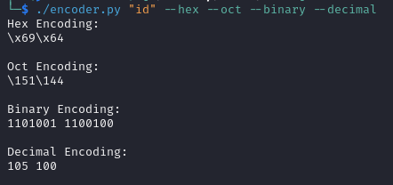

## Encode commands into (hex | octal | decimal | binary) formats
The command can be used to encode payloads to bypass filters in certain scenarios as shown below.

Hex encoding of `echo "Hello World!"` piped to `sh`.
